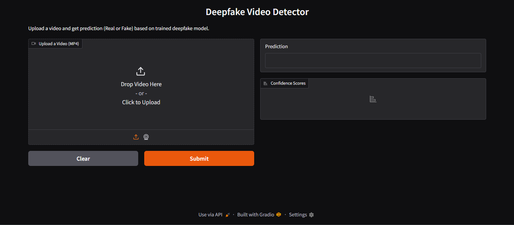
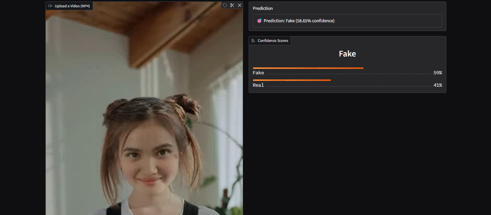

# 🧠 Deepfake Video Detector Model (CNN-based)

This is a deep learning project to detect whether a video is **real** or **deepfake**, using a Convolutional Neural Network (CNN) trained on the [SDFVD2.0 Deepfake Dataset](https://www.kaggle.com/datasets).

---

## 📸 Screenshots

### 🔹 Gradio Interface (Upload & Prediction)

### 🔹 Confidence Score Output

---

## 🚀 Features

- Upload MP4 videos and detect if they are real or deepfake.
- Uses OpenCV for frame extraction and TensorFlow CNN model for classification.
- Gradio-based UI for a simple and interactive frontend.
- Provides confidence scores for predictions.
- Displays classification metrics like accuracy, precision, recall, F1-score, and ROC curve.

🧪 Evaluation Metrics
The trained model is evaluated using standard classification metrics:

✅ Accuracy

✅ Precision

✅ Recall

✅ F1-Score

✅ Confusion Matrix

✅ ROC-AUC Curve

These are calculated using scikit-learn and visualized with matplotlib.

🎛️ Web App Interface
We used Gradio to build a web interface where users can upload a video and get predictions.

🎥 Workflow:
Upload a .mp4 video

Model extracts frames

Predicts each frame

Averages predictions

Returns result (Real or Fake) with confidence

💻 Technologies Used
Category	Tools / Libraries
Language	Python
Deep Learning	TensorFlow, Keras
Computer Vision	OpenCV
UI/Frontend	Gradio
ML Utilities	NumPy, Pandas, Scikit-learn, Matplotlib
Deployment	Colab / Gradio Live / Hugging Face Spaces

## 🔍 Project Overview

The rise of **AI-generated deepfake content** is a major concern for digital media, security, and misinformation. This project presents a **lightweight CNN-based detector** that helps identify deepfake videos.

🎯 **Goal**: Build a robust model that classifies uploaded `.mp4` videos as either:
- ✅ Real
- ❌ Fake (AI-manipulated)

🧩 **Key Features**:
- Trainable and extendable deep learning model using TensorFlow/Keras
- Uses video frame sampling for faster inference
- Interactive web app built using Gradio
- Live prediction with confidence percentages

---

## 📊 Dataset Description

**SDFVD2.0 - Small Scale Deep Fake Video Dataset**  
We used the **SDFVD2.0 (Small Scale Deep Fake Video Dataset)**, which consists of:
- Real video clips of actual people
- Fake (deepfake) video clips with altered facial expressions or identities

